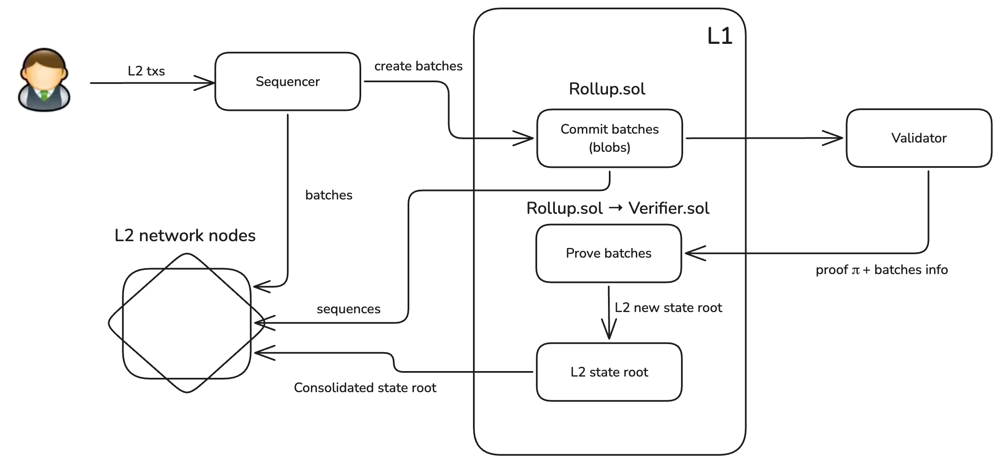

# Tokamak zkEVM Contracts

The Tokamak Network aims to support the Ethereum ecosystem by providing on-demand layer 2 rollups. In other words, the Tokamak ecosystem exists as an extension and subset of the Ethereum ecosystem. Its goal is to let Ethereum users and infrastructure providers seamlessly migrate to Tokamak Network demand arises — and then return to Ethereum once that demand is fulfilled. This flexible model sets Tokamak Network apart from other layer 2 networks, which tend to maintain their own isolated, fixed ecosystems.

This repository implements the core smart contracts for the Tokamak zkEVM rollup solution, providing Layer 2 scalability with Ethereum-equivalent functionality through zero-knowledge proofs.

## Purpose

The Tokamak zkEVM contracts facilitate:
- Rollup consensus and state management
- Transaction sequencing and batch processing
- Interaction with the Tokamak zkSNARK on-chain verifier
- L1-L2 communication bridges



## Features

### Core Components
- **Rollup Contract**: Main coordinator for batch submissions and state updates
- **Verifier Interface**: Standardized interface for zkSNARK proof verification
- **State Transition**: EVM-equivalent state transition logic
- **Bridge Contracts**: Secure asset transfer between L1 and L2

## Test Suite

The contracts are rigorously tested with:

### Verification Tests
- **Proof Verification**: Valid/invalid proof handling
- **Edge Cases**: Empty batches, invalid transitions
- **Gas Benchmarking**: Verification cost analysis

### Integration Tests
- L1-L2 message passing
- Contract upgrades
- Failure recovery scenarios

### Security Tests
- Reentrancy protection
- Permissioned function access
- Denial-of-service resistance

## Getting Started

### Prerequisites
- Foundry (forge, anvil, cast)
- Node.js 16+
- Solidity 0.8.x

### Installation
```bash
git clone https://github.com/tokamak-network/Tokamak-zkEVM-contracts.git
cd Tokamak-zkEVM-contracts
forge install
forge test
```