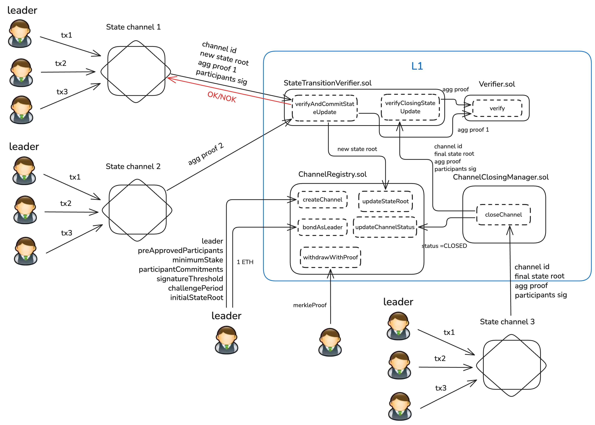

# Tokamak zkEVM Contracts

Our rollup enables on-demand state channels that hold private L2s. State channels are in charge of aggregating proofs and managing state root.

This repository implements the core smart contracts for the Tokamak zkEVM rollup solution, providing Layer 2 privacy with Ethereum-equivalent functionality through zero-knowledge proofs.

## Architecture



## System Components 

### Core Components
The system consists of four main components working in harmony. The state channel layer handles all private transactions and state management within isolated channels. The zkSNARK proving system generates cryptographic proofs of valid state transitions. The Layer 1 smart contracts verify these proofs and maintain channel commitments. 

### Channel Structure

Each state channel is identified by a unique 32-byte identifier and managed by a designated leader address. The channel maintains a Merkle tree containing all account states, with the root hash serving as a cryptographic commitment to the entire channel state. A transaction queue ensures ordered processing, while a monotonically increasing nonce prevents replay attacks.

### Role Definitions
The system defines two distinct roles with specific responsibilities. Channel leaders administer state transitions, add users to the channel, and submit proofs to Layer 1. Channel participants submit transactions, monitor their account states, and must sign when a new state transition occurs (to avoid full trust on leaders).

## Getting Started

### Required Software

#### 1. Foundry Toolkit
Foundry is a blazing fast, portable and modular toolkit for Ethereum development.

```bash
# Install Foundry
curl -L https://foundry.paradigm.xyz | bash

# Follow the instructions to add Foundry to your PATH, then run:
foundryup

# Verify installation
forge --version
cast --version
anvil --version
```

#### 2. Node.js and npm
Required for additional tooling and dependencies.

```bash
# Using nvm (recommended)
curl -o- https://raw.githubusercontent.com/nvm-sh/nvm/v0.39.0/install.sh | bash
nvm install 16
nvm use 16

# Or using your system's package manager
# macOS with Homebrew
brew install node@16

# Ubuntu/Debian
curl -fsSL https://deb.nodesource.com/setup_16.x | sudo -E bash -
sudo apt-get install -y nodejs

# Verify installation
node --version  # Should show v16.x.x
npm --version
```

#### 3. Solidity Compiler
The project uses Solidity 0.8.23. Foundry will handle the compiler installation automatically, but you can also install it manually:

```bash
# Via npm (optional)
npm install -g solc@0.8.23

# Verify the compiler version in foundry.toml
```


### Installation
```bash
git clone https://github.com/tokamak-network/Tokamak-zkEVM-contracts.git
cd Tokamak-zkEVM-contracts
forge install
forge test
```