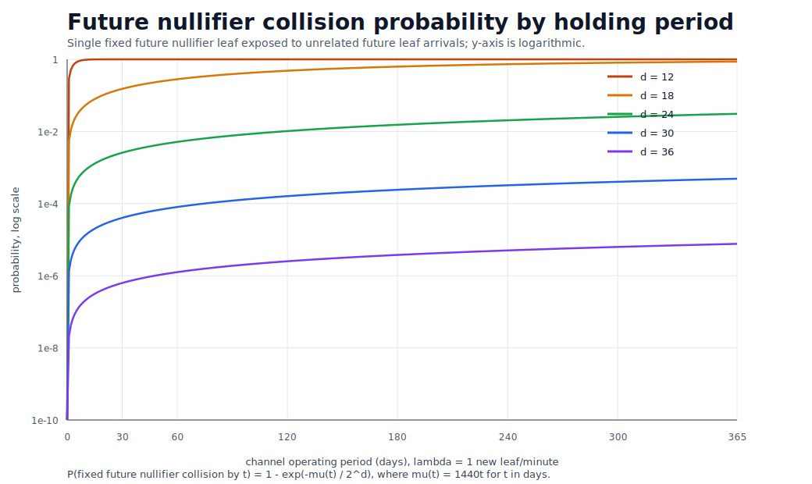

# Bridge and Private-State Mainnet Security Review

Historical notice: this document is a point-in-time review from 2026-04-10. It is retained for audit
history and intentionally preserves the terminology, concrete limits, and findings as they existed
at that review date. It is not maintained as the current mainnet-readiness verdict. For the
consolidated current checklist, current statuses, and resolved/accepted risk classifications, read
[`docs/audit-for-mainnet-deploy.md`](../../docs/audit-for-mainnet-deploy.md).

Date: 2026-04-10

## 1. Scope

This document reviewed the implementation that would have been used to deploy on the review date:

- the L1 bridge stack under `bridge/src`
- the `private-state` DApp under `packages/apps/private-state/src`

The review is focused on two threat classes:

- malicious use that can manipulate funds
- malicious use or operational abuse that can deny service or strand user funds

This is a current-implementation review, not an abstract protocol proof.

## 2. Review Inputs

Reviewed code and artifacts:

- `bridge/src/BridgeCore.sol`
- `bridge/src/L1TokenVault.sol`
- `bridge/src/ChannelManager.sol`
- `bridge/src/DAppManager.sol`
- `packages/apps/private-state/src/PrivateStateController.sol`
- `packages/apps/private-state/src/L2AccountingVault.sol`
- `packages/apps/private-state/cli/private-state-bridge-cli.mjs`
- `bridge/scripts/DeployBridgeStack.s.sol`
- `deployment/chain-id-11155111/bridge/<timestamp>/bridge.11155111.json`
- `deployment/chain-id-11155111/dapps/private-state/<timestamp>/dapp-registration.11155111.json`
- `test/private-state/PrivateStateController.t.sol`
- `bridge/test/BridgeFlow.t.sol`

Verification performed:

- `forge test` in `bridge/`: passed `40/40`
- unique-success-path checker on `PrivateStateController`: all mint and transfer entrypoints passed; the checker failed to parse the redeem family because of inline assembly, so redeem entrypoints were reviewed manually

Verification limitation:

- the repository root Foundry configuration still compiles legacy broken tests under `test/bridge`, so `make test` for `packages/apps/private-state` currently fails before it can isolate the private-state suite

## 3. Executive Conclusion

The current system is **not ready for open mainnet deployment as-is**.

I did not find an unprivileged direct-drain path in the current bridge or DApp logic under the following assumptions:

- the Groth16 verifier is sound
- the Tokamak verifier is sound
- the registered DApp metadata is correct
- the owner key is honest and uncompromised

However, the current implementation still has several deployment-blocking risks:

1. A privileged owner can replace verifiers or upgrade core contracts and thereby steal or freeze all funds.
2. Channel registration is permissionless and bounded by only `4096` reserved token-vault leaf indices, which allows channel-join denial of service through registration exhaustion.
3. The managed storage model projects 256-bit storage keys into a finite Merkle leaf domain, which can create leaf-index collisions that deny valid state transitions and, in `private-state`, can strand otherwise valid notes before they are spent.

The shared L1 vault still increases incident blast radius, but this review treats that as an architectural observation rather than a standalone present-code finding.

Mainnet deployment is reasonable only after those items are explicitly addressed or the launch is intentionally constrained to a trusted pilot with strict user caps and trusted operators.

## 4. Security Properties That Hold in the Current Code

### 4.1 L1 custody is not directly writable by the DApp

The `private-state` DApp cannot move canonical ERC-20 custody on its own. Canonical token movement is restricted to:

- `fund(...)`
- `claimToWallet(...)`
- Groth-backed `depositToChannelVault(...)`
- Groth-backed `withdrawFromChannelVault(...)`

See `bridge/src/L1TokenVault.sol`.

### 4.2 The L2 accounting vault is controller-only and field-bounded

`L2AccountingVault` has:

- immutable controller binding
- no user-facing transfer, deposit, or withdraw entrypoint
- BLS12-381 scalar-field overflow checks on credits
- underflow protection on debits

See `packages/apps/private-state/src/L2AccountingVault.sol`.

### 4.3 Note lifecycle functions preserve ownership and value

`PrivateStateController` enforces:

- input note ownership by `msg.sender`
- exact input/output value conservation for transfer paths
- one-time nullifier usage
- one-time commitment creation
- credit back to liquid balance only through redeem paths

See `packages/apps/private-state/src/PrivateStateController.sol`.

### 4.4 The bridge rejects unsupported token transfer behavior

The L1 vault explicitly rejects fee-on-transfer style token deltas in both ingress and egress paths.

That protects accounting soundness for the assumed canonical token model.

### 4.5 Privacy for `private-state` under a strong external observer

This subsection discusses privacy only for the current `private-state` implementation and only under the following observation model.

Actors:

- strong external observer
  - sees all L1 bridge transactions
  - sees all bridge and DApp events
  - sees the registered function set and can classify note-transition arities
  - is allowed to perform long-horizon graph analysis over all observed note activity
- user
  - chooses how to use `mintNotes*`, `transferNotes*`, and `redeemNotes*`
  - wants to avoid giving the observer any linkage that the observer can establish with `100%` certainty

For this subsection, "linkage" means only a linkage that the observer can assert with `100%` certainty. Purely probabilistic narrowing, heuristic scoring, or candidate-set reduction does not count as a successful linkage under this definition.

Two privacy properties are relevant:

- ownership unlinkability
  - the observer cannot assign a note, or a spent/redeemed note lineage, to one unique owner identity with `100%` certainty
- amount privacy
  - the observer cannot assign one unique individual note amount, or one unique internal decomposition of a redeemed total into note amounts, with `100%` certainty

Important boundary:

- this subsection is about owner identity and note amount
- it is not claiming that all note-lineage structure is hidden
- a long-horizon observer may still reconstruct partial note graphs or reduce the candidate set without reaching `100%` certainty

Why the current implementation still leaves room for limited privacy strategies:

- `PrivateStateController` binds spend authority to the DApp-level `msg.sender`
- but the L1 caller of `ChannelManager.executeChannelTransaction(...)` is not itself the note owner identity
- therefore the strongest direct owner anchor, "the L1 relayer is the spender," does not hold in the current architecture
- note value disclosures are also indirect: the observer can see redeem totals once value returns to liquid balance, but individual note values are not emitted in plaintext

What the strong observer still learns:

- the function family and arity of each transition
- when notes are created, spent, or redeemed
- ciphertext-bearing `NoteValueEncrypted` emissions
- enough event structure to perform long-horizon graph analysis

That means the current implementation does not provide strong cryptographic privacy in the usual anonymous-payment sense. However, under the narrower `100%`-certainty definition above, the user can still choose note flows that avoid deterministic linkage.

Existence result:

- yes, under the current implementation there exist user strategies that prevent the observer from obtaining both ownership linkage and amount linkage with `100%` certainty
- this statement is limited to the current observation model and to the `100%`-certainty notion of linkage
- it is not a claim that the observer cannot infer likely owners or likely note values with high confidence

Minimal strategy shape:

- avoid singleton note life cycles such as:
  - `mintNotes1` followed later by `redeemNotes1`
  - `transferNotes1To1` followed by `redeemNotes1`
- create at least two notes that will later be redeemed only through a multi-input redeem shape
- do not let the observed execution history collapse back to one uniquely explainable note lineage before redeem

The simplest concrete strategy in the current implementation is:

1. create at least two notes, for example with `mintNotes2`
2. avoid `redeemNotes1`
3. redeem only through a multi-input redeem path such as `redeemNotes2`

Why this works under the current definition:

- the observer sees the final redeemed total
- but the observer does not obtain a unique individual note amount assignment for the two redeemed notes
- and because the L1 caller is not the note owner identity, the observer also lacks a direct deterministic owner anchor for those notes

Stronger user-side strategy:

- mint multiple notes
- use `transferNotes1To2` and `transferNotes2To1` to split and merge value before redeem
- redeem only after the note graph admits more than one consistent ownership explanation and more than one consistent internal amount decomposition

This combinatorial strategy is the right mental model for the current implementation:

- the user does not try to make observation impossible
- the user tries to keep at least two fully consistent explanations alive at every critical step
- if at least two such explanations remain, the observer does not get a `100%`-certainty linkage

Examples that are bad for privacy under this definition:

- `mintNotes1` then `redeemNotes1`
  - the redeemed total uniquely identifies the note amount
- `mintNotes1` then `transferNotes1To1` then `redeemNotes1`
  - the life cycle remains singleton-shaped and easier to explain uniquely
- any flow that eventually leaves only one consistent explanation for who owned the redeemed note set or how the redeemed total decomposes into note amounts

Practical conclusion:

- under the current implementation, privacy is strategy-dependent rather than protocol-guaranteed
- if the user chooses singleton note flows, ownership unlinkability and amount privacy can collapse quickly
- if the user deliberately maintains ambiguity through multi-note mint, split/merge transfer, and multi-note redeem flows, then a strong external observer can still analyze the graph but may fail to obtain `100%`-certainty linkage for owner identity and individual note amounts

## 5. Findings

### Finding 1: Privileged owner can forge, freeze, or rewrite custody

Severity: Critical

Relevant code:

- `bridge/src/BridgeCore.sol:89-106`
- `bridge/src/BridgeCore.sol:208`
- `bridge/src/L1TokenVault.sol:200`
- `bridge/src/DAppManager.sol:384`
- `bridge/scripts/DeployBridgeStack.s.sol:35-90`
- `deployment/chain-id-11155111/bridge/<timestamp>/bridge.11155111.json:12-18`

Why it matters:

- `BridgeCore` owner can replace the Groth16 verifier.
- `BridgeCore` owner can replace the Tokamak verifier.
- every major bridge contract is UUPS-upgradeable under owner control.
- the Sepolia deployment artifact shows a single EOA as both `deployer` and `owner`.

Fund-manipulation impact:

- a malicious verifier can accept forged root transitions
- a malicious upgrade can bypass proof checks entirely
- a malicious vault upgrade can transfer assets out of custody
- a malicious DAppManager or BridgeCore upgrade can rewrite channel metadata or registry behavior

Service-disruption impact:

- the same powers can freeze deposits, withdrawals, claims, or channel execution
- users have no trust-minimized escape hatch if the owner key is compromised

Mainnet consequence:

- user funds are currently only as safe as the owner key
- this is incompatible with an open mainnet launch unless governance is intentionally centralized and fully disclosed

Required before mainnet:

- move bridge ownership to a well-audited multisig before user funds arrive
- separate emergency pause authority from upgrade authority
- stop using one globally mutable verifier pointer for all existing channels
- snapshot the current Groth16 verifier and Tokamak verifier into each channel at channel-creation time, and make those channel-scoped verifier addresses immutable for the lifetime of that channel
- if a verifier bug is discovered after channel creation, do not upgrade that channel's verifier in place; instead, pause or deprecate the affected channel, deploy a fresh channel that snapshots the newer verifier, and migrate users explicitly
- treat `BridgeCore.setGrothVerifier(...)` and `BridgeCore.setTokamakVerifier(...)` as defaults for future channels only, not as retroactive rewrites of already-open channels
- if any verifier-default update remains owner-controlled, add a timelock or staged activation process for new-channel deployments that rely on the new verifier
- publish an explicit policy for when verifier rotation or upgrades are allowed
- strongly consider freezing custody-critical upgrades after a maturation period, even if future-channel verifier defaults remain configurable

### Finding 2: Channel registration is sybil-exhaustible through leaf-index reservation

Severity: High

Relevant code:

- `bridge/src/ChannelManager.sol:222-272`
- `packages/apps/private-state/cli/private-state-bridge-cli.mjs:1052-1113`
- `bridge/src/ChannelManager.sol:71`
- `bridge/src/ChannelManager.sol:245-266`

Why it matters:

`registerChannelTokenVaultIdentity(...)` accepts caller-supplied:

- `l2Address`
- `channelTokenVaultKey`
- `leafIndex`
- `noteReceivePubKey`

The bridge only checks local consistency:

- one registration per L1 address
- one registration per L2 address
- one registration per storage key
- one registration per leaf index
- `leafIndex == storageKey % 4096`

The critical point for denial of service is that registration reserves the `leafIndex` immediately, before any bridge deposit happens. The function records the reservation in `_channelTokenVaultLeafOwners`, so `join-channel` alone can consume one of the `4096` admissible registration indices for that channel.

Attack scenarios:

1. Leaf-index reservation exhaustion
   - the channel token-vault tree admits only `4096` registration indices
   - an attacker can create many L1 accounts and call `join-channel` repeatedly
   - each successful registration reserves one `leafIndex` even if the attacker never deposits into the channel
   - once enough indices are reserved, new legitimate users cannot register for that channel at all

2. Channel griefing without capital commitment
   - the attacker does not need to fund the bridge vault first
   - the attacker does not need to move value into L2
   - the attacker only pays registration gas, so the cost to deny channel access is much lower than the cost imposed on honest users

Fund-manipulation impact:

- this is primarily a liveness attack, not a clean theft primitive
- however, it can strand funds in the shared bridge vault because users cannot complete the L1-to-channel transition

Service-disruption impact:

- joining a channel can be denied at scale
- an otherwise healthy channel can become closed to new participants
- operators may need to create and migrate users to a fresh channel even though the old channel's proof logic remains sound

Required before mainnet:

Refined implementation plan under the current policy decisions:

- replace the current gas-only `join-channel` path with a paid join flow that:
  - removes the standalone free registration call from the user-facing CLI
  - charges a TON-denominated join toll
  - stores that fee in a bridge-controlled treasury that no operator, leader, or channel creator can withdraw from directly
  - creates the channel registration only inside the same transaction that pays the join toll
- make the join toll channel-configurable:
  - the channel creator chooses the initial TON join toll at `createChannel(...)` time
  - the channel creator may update that channel's join toll later
  - the changed toll applies only to future joins; existing registrations must not be rewritten in place
- remove the earlier `minimumBootstrapBalance` requirement and do not force a channel deposit at join time
- remove the earlier requirement that every withdraw must be an exit, so post-join channel balance management may continue independently of registration lifetime
- add an exit path that:
  - requires `currentUserValue == 0`
  - deletes the registration and frees the reserved `leafIndex`, key binding, L2 address binding, and note-receive key binding only after the full exit path succeeds
  - allows the same L1 account to rejoin the same channel after a successful exit
  - refunds only a time-decayed fraction of the recorded join toll back to the exiting user from treasury
  - computes the refundable fraction from an owner-updatable lookup table
  - starts with the following schedule:
    - exit within 6 hours: `75%`
    - exit within 24 hours: `50%`
    - exit within 3 days: `25%`
    - exit after 3 days: `0%`
  - preserves the invariant that no treasury outflow path exists except this decayed exit refund
- extend the per-user registration state with:
  - the recorded join-toll-paid amount
  - the join timestamp or equivalent epoch marker used for refund decay
- update the CLI and user guidance so:
  - `join-channel` becomes a paid registration action rather than a free reservation call
  - `deposit-channel` and `withdraw-channel` remain regular balance-management actions for already-registered users
  - the CLI refuses `exit` unless the current channel balance is already zero
  - the exit flow clearly discloses the current refund fraction before the user confirms
- preserve transaction atomicity:
  - if the paid join path fails, the registration and toll side effects must roll back together
  - if exit cleanup or refund transfer fails, the registration deletion must also revert

Additional review of the refined plan:

- This strategy is more directly aligned with the real DoS surface than the earlier bootstrap-balance design.
  - The attack being priced is slot occupancy over time, not merely zero-activity registration.
  - A user who occupies a slot for a long time and exits later pays an increasingly unrecoverable fee.
- Compared with a fully non-refundable fee, the refund schedule weakens short-horizon deterrence but strengthens long-horizon deterrence relative to the earlier full-refund empty-exit policy.
  - An attacker can still join, wait briefly, and exit with a high refund if the decay curve is too slow.
  - An attacker who occupies slots for a long period can no longer recover the full fee simply by performing one last-minute action before exit.
- The main deterrent is now the non-refunded fraction of the join toll as a function of occupancy time:
  - short-lived joins remain relatively cheap if the early refund buckets are generous
  - long-lived slot occupation becomes increasingly expensive as the refund fraction decays
- Because the bootstrap-deposit requirement is removed, the design no longer benefits from capital-lock deterrence.
  - The join toll schedule therefore becomes the dominant anti-DoS control.
- Mutable creator-controlled join tolls introduce a new governance and fairness risk:
  - the channel creator can make future joins economically impossible by raising the toll
  - the channel creator can also lower the fee for a favored cohort and effectively turn a nominally permissionless channel into a creator-priced admission system
- Because of that, the implementation must define whether fee changes are expected operational behavior or an abuse case that should be disclosed to users as a trust assumption.
- Refund accounting must be tied to the toll actually paid at join time.
  - If exit refunds use the current fee rather than the recorded paid fee, later fee increases create an over-refund drain on the treasury and later fee decreases create under-refunds.
- The refund schedule itself becomes a privileged governance lever because the bridge owner can change the lookup table after channels are live.
  - A tighter table can make exits much more expensive than users expected at join time.
  - A looser table can weaken DoS deterrence retroactively.
  - This refund-schedule mutability must therefore be disclosed as a trust assumption unless it is time-locked or future-only.
- The current policy also leaves one operational design choice to be disclosed clearly:
  - the treasury becomes a sink for non-refunded join tolls, with outflows only for decayed exit refunds
  - if that is the intended terminal behavior, the system should document that those fees are not protocol revenue and are not claimable by governance or operators

Expected mitigation strength:

- this materially improves the current finding because leaf exhaustion is no longer a gas-only sybil attack
- exhausting all `4096` indices would require, per occupied slot:
  - one TON-denominated join toll paid into treasury
  - acceptance of whatever non-refundable fraction remains after the chosen occupancy duration
- an attacker who wants to recycle capital instead of leaving slots permanently occupied would recover only the decayed refund fraction, not the full fee
- the attack therefore becomes an economic denial of service rather than a near-free registration griefing primitive
- this is still not a complete fix:
  - a sufficiently well-funded attacker can still fill all slots
  - if the early refund buckets are too generous over the attacker's intended time horizon, short-lived occupancy can still be cheap
  - honest users must also pay the same entry cost and are exposed to future creator-driven fee increases
  - honest users are also exposed to bridge-owner changes to the refund table unless those changes are constrained to future joins only

### Finding 3: Managed storage leaf-index collisions can deny valid transitions and strand notes

Severity: High

Relevant code:

- `tokamak-l2js` `TokamakL2StateManager`
- `packages/apps/private-state/src/PrivateStateController.sol`
- `packages/apps/private-state/cli/private-state-bridge-cli.mjs`
- `bridge/src/ChannelManager.sol`

Why it matters:

The current state model uses a finite storage Merkle tree per managed storage address. A concrete storage key is not represented by its full `256`-bit path. Instead, it is projected into a finite leaf domain of size:

$$
N = 2^d
$$

where `d` is the configured Merkle tree depth (`MT_DEPTH`).

In the current implementation, the effective leaf index is derived from the storage key inside that finite domain. Therefore, for any `d < 256`, distinct storage keys can map to the same leaf index. This is not a normal EVM property. It is introduced by the bridge and state-manager storage abstraction.

For `private-state`, this is especially dangerous because:

- note commitments are tracked through hashed mapping keys
- nullifiers are also tracked through hashed mapping keys
- both key families are effectively pseudorandom over `256` bits

As a result, the system can reject a valid state transition even when the DApp logic itself is correct, simply because two unrelated storage keys collide in the finite leaf domain.

`private-state`-specific consequence:

For an unused note, the future nullifier is fixed by the note contents. If that future nullifier's storage key collides with another key later, the note can become permanently unspendable. The user cannot "retry" a different nullifier for the same note, because the nullifier is already determined by the note `(value, owner, salt)`.

This is stronger than ordinary liveness degradation:

- a note may be valid when minted
- the note may remain unused
- a later unrelated storage write can collide with that note's future nullifier leaf
- at that point, spending the note may become impossible under the current dense-leaf state model

Fund-manipulation impact:

- this review did not identify a direct theft primitive from this issue alone
- the main impact is denial of service and potential permanent loss of note usability

Service-disruption impact:

- valid proofs can be blocked by leaf-index collisions
- users can hold notes that later become unspendable without any fault in the note owner workflow
- the effect is especially severe for long-lived notes because their future nullifier remains exposed to future collisions over time

Collision probability for a future nullifier:

Assume:

- the note is already minted
- the CLI already avoided any collision for the note's commitment at creation time
- the remaining concern is the note's single future nullifier leaf
- future storage keys arrive as a Poisson process with rate `\lambda`
- each future key is effectively uniform over the finite leaf domain of size `N = 2^d`

For one future key, the probability that it lands on the note's future nullifier leaf is:

$$
\Pr[\text{collision from one future key}] = \frac{1}{N} = 2^{-d}
$$

Let `M(t)` be the number of future keys that arrive by time `t`. Under a Poisson arrival model:

$$
M(t) \sim \operatorname{Poisson}(\lambda t)
$$

By Poisson thinning, the number of future keys that hit the specific nullifier leaf is:

$$
M_{\text{hit}}(t) \sim \operatorname{Poisson}\left(\frac{\lambda t}{N}\right)
$$

Therefore, the probability that at least one future key collides with that note's nullifier leaf by time `t` is:

$$
\Pr[\text{future nullifier collision by time } t]
= 1 - \Pr[M_{\text{hit}}(t)=0]
= 1 - \exp\left(-\frac{\lambda t}{N}\right)
$$

Substituting `N = 2^d` gives:

$$
\Pr[\text{future nullifier collision by time } t]
= 1 - \exp\left(-\lambda t \cdot 2^{-d}\right)
$$

The expected collision time is:

$$
\mathbb{E}[T] = \frac{2^d}{\lambda}
$$

For the graph below, the arrival model uses a mean interarrival time of `1.5` minutes, so:

$$
\lambda = \frac{2}{3}\ \text{per minute}
$$

and the plotted probability is:

$$
\Pr[\text{future nullifier collision by time } t]
= 1 - \exp\left(-\frac{2}{3}\cdot 1440 \cdot t \cdot 2^{-d}\right)
$$

with `t` measured in days.

Why this is deployment-blocking:

- the failure mode can strand user notes without any malicious action by the note owner
- the risk grows over time for long-lived notes
- the risk comes from the bridge/state model, not from application-level misuse alone

Possible solutions:

1. Replace dense finite leaf projection with a sparse key-as-path storage tree.
   - This is the only clean way to remove collisions in principle.
   - Distinct `256`-bit storage keys must not be folded into a smaller leaf domain.

2. Introduce an authenticated `storageKey -> leafIndex` allocation layer.
   - This can eliminate random collisions, but it adds new state, proof complexity, capacity management, and replay requirements.
   - It turns a collision problem into an allocation-capacity problem.

3. Split storage domains across distinct contract addresses.
   - This can remove cross-domain collisions, for example between commitment storage and nullifier storage.
   - It does not remove commitment-commitment or nullifier-nullifier collisions within each domain.
   - It also leaks more structure about which writes correspond to note creation versus note spending.

4. Add CLI-side prechecks for output-note commitment and future-nullifier collisions.
   - This is only a partial mitigation.
   - It can reject obviously unsafe new outputs at creation time.
   - It cannot guarantee safety against future unrelated keys, and it cannot rescue an already-created note whose future nullifier later collides.

Required before mainnet:

- do not present the current dense storage projection as safe for long-lived privacy notes
- either move to a collision-free storage representation or explicitly constrain the system to a trusted pilot where note lifetime and channel activity are tightly limited
- disclose that under the current model a valid unused note can become unusable later because of future nullifier collisions

### Finding 4: Exact-transfer token behavior is a hard external dependency

Severity: Medium

Relevant code:

- `bridge/src/L1TokenVault.sol:78-89`
- `bridge/src/L1TokenVault.sol:122-139`

Why it matters:

The bridge hard-wires the canonical asset to Tokamak Network Token through `BridgeCore.canonicalAsset()`, and the vault logic requires that token to continue behaving like an exact-transfer ERC-20.

If the token ever:

- pauses transfers
- blacklists the vault or users
- adds fees
- rebases in a way that changes observed deltas

then `fund(...)` and `claimToWallet(...)` can revert.

Fund-manipulation impact:

- this does not create a new theft primitive inside the bridge
- it does create an external trust dependency that can make exits unavailable

Service-disruption impact:

- deposits can fail
- claims can fail
- users can remain solvent on paper but unable to move assets out of the shared vault

Required before mainnet:

- explicitly accept Tokamak Network Token transfer behavior and governance as a bridge trust assumption
- publish that assumption in operator and user risk disclosures instead of presenting the bridge as token-agnostic

## 6. Additional Observations

### 6.1 `leader` is not an execution gate

`ChannelManager` stores a `leader`, but `executeChannelTransaction(...)` is permissionless.

That is good for liveness, but it means:

- any party can relay a valid proof
- no security property should assume that only the stored leader can sequence channel execution

### 6.2 No direct user path exists into `L2AccountingVault`

This is a positive property.

The current app respects bridge-managed custody:

- users do not call the L2 accounting vault directly
- only the immutable controller can mutate liquid balances

### 6.3 Mint and transfer entrypoints satisfy the single-success-path check

The static checker passed all mint and transfer entrypoints.

The redeem family could not be parsed by the checker because of inline assembly around the zero-address guard, but manual review indicates the redeem functions also follow a single success path:

- zero-address receiver guard
- fixed-arity note preparation
- nullifier consumption
- one credit into `L2AccountingVault`

### 6.4 Shared vault custody increases incident blast radius

This review did not identify a direct present bug that lets one channel steal another channel's funds solely because all channels share one `bridgeTokenVault`.

The current implementation still binds Groth and Tokamak acceptance to channel-specific registrations, roots, and metadata, so pooled custody is not treated here as an independent exploit primitive.

It remains worth disclosing as an architectural observation:

- if some other proof-acceptance or accounting bug is discovered later, losses would hit one global custody pool rather than a naturally isolated per-channel vault
- incident response on the shared vault would still affect every channel together

That is weaker than a standalone finding, but it is still relevant for rollout sizing, TVL caps, and migration planning.

## 7. Mainnet Readiness Verdict

### Must fix before open mainnet

- privileged owner can rotate verifiers and upgrade core contracts
- channel registration can be sybil-exhausted through leaf-index reservation
- managed storage leaf-index collisions can strand notes or block valid transitions

### Strongly recommended before meaningful TVL

- reduce the blast radius of the shared vault architecture
- add emergency pause and incident-response controls
- document exact supported note shapes per deployment
- verify the canonical token's transfer and governance behavior

### Acceptable in the current code

- unprivileged users cannot directly mutate L1 custody without proofs
- app note transfers preserve value and ownership constraints
- liquid accounting mutations are controller-only and BLS-field-bounded

## 8. Bottom Line

If the question is whether the current bridge and `private-state` DApp are ready for unrestricted Ethereum mainnet usage with real user funds, the answer is **no**.

If the launch is intentionally limited to a trusted pilot, then the minimum acceptable posture is:

- multisig-controlled ownership from day one
- strict user-count and TVL caps
- explicit disclosure that channel join can currently be griefed
- pre-created channels only after verifying the exact registered function set that users need

Without those controls, the present design leaves both custody integrity and service availability too exposed for a permissionless mainnet deployment.
