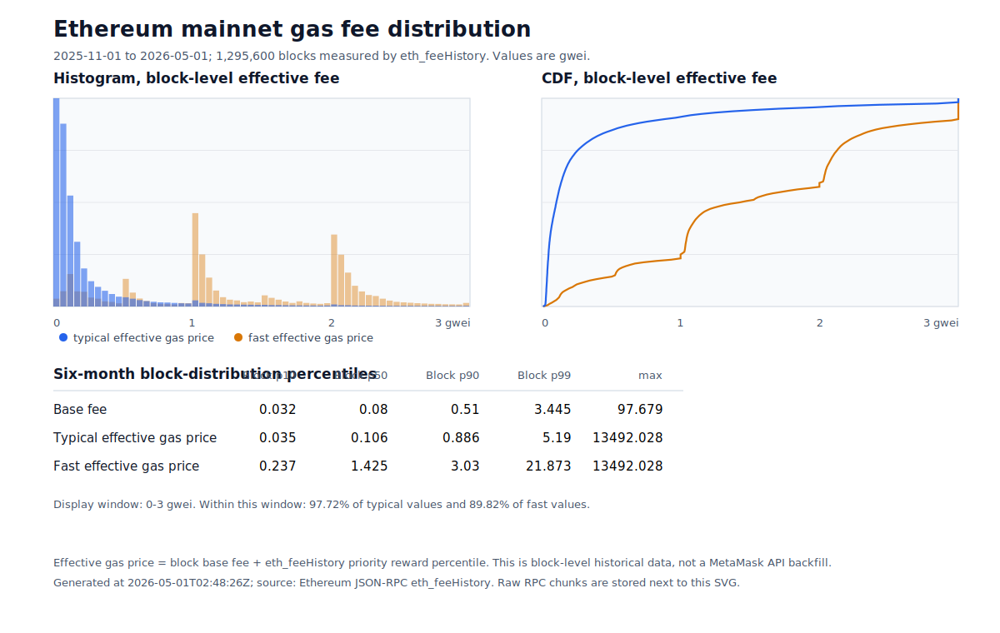

# Bridge Gas Prices

Measurement timestamp: 2026-05-01T02:12:20Z / 2026-05-01 10:12:20 +08.

ETH/USD: 2,267.90 USD.

MetaMask Ethereum mainnet gas inputs at the measurement timestamp:

| MetaMask tier | Estimated base fee | Suggested priority fee | Effective gas price used below | Suggested max fee cap |
|---|---:|---:|---:|---:|
| Low | 0.232963096 gwei | 0.001198516 gwei | 0.234161612 gwei | 0.234161612 gwei |
| Medium | 0.232963096 gwei | 2 gwei | 2.232963096 gwei | 2.333137228 gwei |
| High | 0.232963096 gwei | 2 gwei | 2.232963096 gwei | 2.333137228 gwei |

USD values use `gasUsed * effectiveGasPriceGwei * 1e-9 * ETH_USD`. The suggested max fee cap is a ceiling, not the amount necessarily charged after EIP-1559 base-fee refunding. The call cost tables below use the six-month historical `Typical effective gas price` baselines, not the timestamped MetaMask tiers.

## Six-Month Historical Distribution

The chart below summarizes Ethereum mainnet block-level fee history from 2025-11-01 to 2026-05-01, generated at 2026-05-01T02:48:26Z. It covers blocks 23,701,606 through 24,997,205, for 1,295,600 blocks total.

The historical data comes from Ethereum JSON-RPC `eth_feeHistory` with reward percentiles 10, 50, and 90. Effective gas price is calculated as `block base fee + priority reward percentile`. This is a block-level historical fee distribution, not a historical MetaMask recommendation backfill. The chart's x-axis is focused on 0-3 gwei; that window contains 97.72% of the typical effective gas price series and 89.82% of the fast effective gas price series in the measured range.

The table columns are percentiles across the measured six-month block set: `Block p50` is the median block-level value, `Block p90` means 90% of measured blocks were at or below that value, and `Block p99` means 99% of measured blocks were at or below that value. `Typical effective gas price` uses the in-block p50 priority reward from `eth_feeHistory`; `Fast effective gas price` uses the in-block p90 priority reward.

| Metric | Block p10 | Block p50 | Block p90 | Block p99 | Max |
|---|---:|---:|---:|---:|---:|
| Base fee | 0.032 gwei | 0.080 gwei | 0.510 gwei | 3.445 gwei | 97.679 gwei |
| Typical effective gas price | 0.035 gwei | 0.106 gwei | 0.886 gwei | 5.190 gwei | 13,492.028 gwei |
| Fast effective gas price | 0.237 gwei | 1.425 gwei | 3.030 gwei | 21.873 gwei | 13,492.028 gwei |

At the measurement timestamp above, MetaMask Medium and High both used a 2 gwei priority fee. Against the six-month `eth_feeHistory` distribution, that setting is above the median typical effective gas price, but it is still within the observed fast-inclusion band: fast effective gas price has a six-month median of 1.425 gwei and a six-month Block p90 value of 3.030 gwei.

The raw RPC response chunks used to generate the chart are stored at `assets/ethereum-gas-fee-history-2025-11-01-to-2026-05-01.eth-fee-history.raw.jsonl.gz`. Each JSONL record stores the original `eth_feeHistory` request parameters and result payload; gas quantities remain in the original hex-encoded wei format returned by the RPC endpoint.

## Owner And Operator Calls

| Function | Caller role | Measured gas used | Measurement source | USD at 0.106 gwei (Typical Block p50) | USD at 0.886 gwei (Typical Block p90) |
|---|---|---:|---|---:|---:|
| `DAppManager.bindBridgeCore` | Owner | 26,069 | Forge gas report | $0.006 | $0.052 |
| `DAppManager.registerDApp` | Owner | 276,832-1,007,387 | Forge gas report | $0.067-$0.242 | $0.556-$2.02 |
| `DAppManager.updateDAppMetadata` | Owner | 194,667-390,176 | Forge gas report | $0.047-$0.094 | $0.391-$0.784 |
| `DAppManager.deleteDApp` | Owner, Sepolia/local only | 13,880-148,990 | Forge gas report | $0.003-$0.036 | $0.028-$0.299 |
| `BridgeCore.bindBridgeTokenVault` | Owner | 5,163-9,208 | Forge gas report | $0.001-$0.002 | $0.010-$0.019 |
| `BridgeCore.setGrothVerifier` | Owner | 9,089 | Forge gas report | $0.002 | $0.018 |
| `BridgeCore.setTokamakVerifier` | Owner | 9,001 | Forge gas report | $0.002 | $0.018 |
| `BridgeCore.setJoinFeeRefundSchedule` | Owner | 16,561 | Forge gas report | $0.004 | $0.033 |
| `BridgeCore.createChannel` | Owner | 3,796,845 | CLI E2E receipt | $0.913 | $7.63 |
| `BridgeAdminManager.setMerkleTreeLevels` | Owner | 2,554 | Forge gas report | $0.001 | $0.005 |
| `ChannelManager.setJoinFee` | Channel leader | 22,119-28,418 | Forge gas report | $0.005-$0.007 | $0.044-$0.057 |

## User Calls

| Function | Caller role | Measured gas used | Measurement source | USD at 0.106 gwei (Typical Block p50) | USD at 0.886 gwei (Typical Block p90) |
|---|---|---:|---|---:|---:|
| `L1TokenVault.fund` | User | 72,845-89,945 | CLI E2E receipt | $0.018-$0.022 | $0.146-$0.181 |
| `L1TokenVault.joinChannel` | User | 323,678-326,490 | CLI E2E receipt | $0.078 | $0.650-$0.656 |
| `L1TokenVault.depositToChannelVault` | User | 336,289-336,293 | CLI E2E receipt | $0.081 | $0.676 |
| `ChannelManager.executeChannelTransaction` | User | 830,792-865,664 | CLI E2E receipt | $0.200-$0.208 | $1.67-$1.74 |
| `L1TokenVault.withdrawFromChannelVault` | User | 380,285 | CLI E2E receipt | $0.091 | $0.764 |
| `L1TokenVault.exitChannel` | User | 130,113 | CLI E2E receipt | $0.031 | $0.261 |
| `L1TokenVault.claimToWallet` | User | 52,317 | CLI E2E receipt | $0.013 | $0.105 |

Supporting ERC-20 approvals are not bridge contract calls, but the CLI E2E measured `ERC20.approve` at 45,957 gas, which is about $0.011 at 0.106 gwei and $0.092 at 0.886 gwei using the same ETH/USD input.

## Measurement Sources

| Source | Scope |
|---|---|
| `packages/apps/private-state/scripts/e2e/output/private-state-bridge-cli/summary.json` | Actual local EOA transaction receipts for the private-state bridge CLI flow. |
| `forge test --root bridge --gas-report` | Current-worktree function gas measurements for owner/operator functions that do not have CLI E2E receipts. |
| MetaMask gas API, Ethereum mainnet network 1 | Timestamped low/medium/high fee inputs. |
| Ethereum JSON-RPC `eth_feeHistory` | Six-month block-level base fee and priority reward percentile distribution for the embedded chart; raw chunk responses are stored under `bridge/docs/assets`. |
| CoinGecko simple price API | Timestamped ETH/USD input. |
