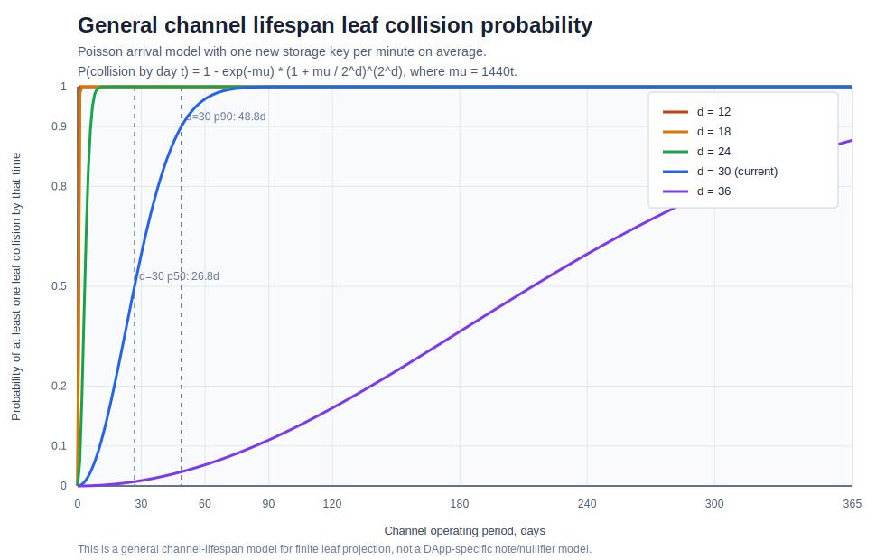

# Security Model

This document describes the security model for the `private-state` DApp. It includes the bridge
security assumptions inherited by the DApp, the local CLI security model, and the note-specific
risks that follow from finite leaf projection.

The document separates three questions that are easy to confuse:

- who has custody of canonical tokens
- who can produce or recover the secrets needed to use notes
- whether the finite Merkle leaf domain can block an otherwise valid state transition

The first question is answered by the bridge. The second is answered by the CLI wallet and key
derivation model. The third is a capacity and liveness issue inherited from the bridge storage model.

## 1. Security Boundaries

The DApp inherits the bridge's core security boundary:

- L1 keeps canonical token custody through the shared bridge vault.
- The DApp stores L2 accounting state and private note state only.
- Users generate proofs locally from private inputs.
- L1 accepts state transitions only after bridge-side proof and metadata checks pass.
- A channel is governed by the DApp metadata, verifier snapshot, function root, managed storage
  vector, and join-toll policy that were fixed when that channel was created.

In this document, `security boundary` means the line beyond which the DApp does not claim direct
control. For example, `private-state` can define how notes are minted, transferred, and redeemed, but
it does not define who may upgrade the bridge root contracts or whether the canonical token keeps
exact-transfer behavior.

The DApp itself adds three local secret domains:

- the user's Ethereum private key
- the channel-bound L2 private key
- the channel-scoped note-receive private key

The wallet password protects the encrypted local wallet file. It is a local-storage protection
secret, not a bridge-side secret.

## 2. Bridge-Inherited Security Model

`private-state` is not a standalone custody system. It relies on the bridge for custody, verifier
selection, DApp metadata registration, channel creation, and proof acceptance.

The important inherited properties are:

- Ethereum is the custody and validity anchor.
- DApp execution is admitted through registered bridge metadata, not through arbitrary runtime ABI
  interpretation.
- Existing channels keep their own immutable policy snapshot.
- Future DApp metadata or verifier updates affect future channels, not already-created channels.
- The canonical asset must behave like an exact-transfer token.
- The bridge owner remains a privileged root operator for UUPS upgrades and future policy updates.

For `private-state`, this means a user should treat channel creation and channel joining as policy
acceptance. The user is accepting the channel's DApp metadata digest, function root, verifier
snapshot, compatible backend versions, managed storage vector, and join-toll policy.

If a bad policy is discovered after a channel is created, the expected recovery path is operational:
announce the affected channel, stop using it, redeem or withdraw through supported flows, and create
a new channel with corrected policy. The existing channel's policy is not meant to be silently
rewritten by a later bridge upgrade.

## 3. Finite Leaf Projection Inherited From The Bridge

The bridge maps storage keys into a finite Merkle leaf domain. Let:

- `d` be the Merkle tree depth
- `N = 2^d` be the leaf domain size
- `t` be the channel operating period
- `lambda` be the average arrival rate of new storage keys that attempt to occupy leaves
- `mu(t) = lambda t` be the expected number of arrived keys

The operational risk is time-dependent. A live channel accumulates storage keys, so the relevant
question is not only whether a static set of keys collides. It is whether at least one collision
appears during the channel's lifetime.

In this document, `leaf collision` means that two different storage keys project to the same finite
Merkle leaf index. It does not mean that the original 256-bit storage keys are equal. The collision
comes from compressing a large key space into a finite tree domain.

Example: if two unrelated storage keys both map to leaf index `42`, the bridge-managed tree cannot
represent them as two independent live leaves at that index. A proof that needs to write the second
key may become unacceptable even if the DApp-level Solidity logic is otherwise valid.

Under a Poissonized occupancy model, each leaf receives an independent Poisson count with mean
`mu(t) / N`. No collision has occurred by time `t` exactly when every leaf has received zero or one
arrival:

$$
\Pr[\text{no collision by } t]
= \left(e^{-\mu(t)/N}\left(1+\frac{\mu(t)}{N}\right)\right)^N
= e^{-\mu(t)}\left(1+\frac{\mu(t)}{2^d}\right)^{2^d}
$$

Therefore:

$$
\Pr[\text{at least one leaf collision by } t]
= 1 - e^{-\mu(t)}\left(1+\frac{\mu(t)}{2^d}\right)^{2^d}
$$

For `mu(t) << 2^d`, this is approximated by:

$$
\Pr[\text{at least one leaf collision by } t]
\approx 1 - \exp\left(-\frac{\mu(t)^2}{2\cdot 2^d}\right)
$$

The graph below uses `lambda = 1/minute`, so `mu(t) = 1440t` when `t` is measured in days.

For the current `d = 36` setting, this model gives a materially longer but still finite
channel-lifespan capacity limit. It is not a statement that any particular note is likely to fail
immediately. It is a statement that a channel with growing storage usage should not be treated as
collision-free forever.

## 4. Future Nullifier Collision Probability

The note-specific risk is different from the general channel collision risk.

The important distinction is between a retryable creation-time failure and a post-creation liveness
failure.

When a note is created, the DApp immediately writes its commitment. If the commitment leaf collides
with an existing occupied leaf, the transaction cannot be accepted in the normal flow. That failure
happens before the note becomes a valid unused note. The user or wallet can construct a different
output, for example by changing the encrypted payload and therefore the salt, and retry.

The nullifier has a different timing profile. A note's nullifier is already determined by the note
plaintext:

- `owner`
- `value`
- `salt`

However, the nullifier is not written until the note is spent, transferred, or redeemed. Therefore an
accepted unused note has a fixed future nullifier leaf that remains exposed while the note is held.
If a later unrelated storage key occupies that leaf before the owner spends the note, the owner
cannot change the nullifier without changing the note itself. But changing the note would also change
the commitment, so it would no longer be the already-accepted note.

This is why future nullifier collision is more severe than commitment collision:

- commitment collision is detected before the note becomes valid, so it is a retryable creation
  failure
- future nullifier collision can occur after the note is already valid, so it can strand an otherwise
  valid unused note

Example: Alice mints a note and the commitment is accepted. The note is now real channel state. Alice
waits before redeeming it. During that waiting period, other channel activity introduces new storage
keys. If one of those keys lands on Alice's future nullifier leaf, Alice's later redeem attempt may
fail because the nullifier write cannot be accepted for that already-occupied leaf. Alice cannot
choose a new nullifier for that same note.

Assume:

- the note has already been accepted
- the note commitment collision was already avoided at creation time
- the remaining target is one fixed future nullifier leaf
- future storage keys arrive as a Poisson process with rate `lambda`
- each future key is effectively uniform over `N = 2^d` leaves

For one future key:

$$
\Pr[\text{collision with the note's future nullifier leaf}]
= \frac{1}{N}
= 2^{-d}
$$

Let `M(t)` be the number of future keys that arrive before the note is spent:

$$
M(t) \sim \operatorname{Poisson}(\lambda t)
$$

By Poisson thinning, the number of future keys that hit this one nullifier leaf is:

$$
M_{\text{hit}}(t) \sim \operatorname{Poisson}\left(\frac{\lambda t}{N}\right)
$$

Therefore:

$$
\Pr[\text{future nullifier collision by } t]
= 1 - \Pr[M_{\text{hit}}(t)=0]
= 1 - \exp\left(-\frac{\lambda t}{N}\right)
$$

Substituting `N = 2^d`:

$$
\Pr[\text{future nullifier collision by } t]
= 1 - \exp\left(-\lambda t \cdot 2^{-d}\right)
$$

If `t` is measured in days and `lambda = 1/minute`, the plotted model is:

$$
\Pr[\text{future nullifier collision by day } t]
= 1 - \exp\left(-1440t\cdot 2^{-d}\right)
$$

The expected collision time for one fixed future nullifier leaf is:

$$
\mathbb{E}[T] = \frac{2^d}{\lambda}
$$

This risk is lower than the general channel-wide probability of any leaf collision because it tracks
one fixed target leaf, not any pair among all occupied leaves. It is still security-relevant because
the consequence is note liveness loss: a valid unused note may later become unspendable.

The practical conclusion is that note age matters. A note that is created and redeemed quickly has
less exposure to future unrelated storage keys. A note held for a long time remains exposed for a
longer period.

## 5. Wallet File Encryption

The CLI stores a channel wallet as an encrypted local file under the workspace.

The wallet password is used to decrypt:

- wallet metadata needed for normal wallet-backed commands
- the stored L1 key copy
- the stored L2 key pair
- tracked note state

The wallet password should be treated as a long-term ownership secret. If the wallet file and wallet
password are both stolen, the attacker can decrypt the wallet and recover key material sufficient to
endanger channel funds.

The password should not be treated like a temporary UI unlock code. It participates in recovering
the channel-bound L2 identity, so losing it can break spendability even if the Ethereum key remains
available.

## 6. Channel-Bound L2 Identity

The channel-bound L2 identity is derived by asking the Ethereum signer to sign a deterministic
message that includes:

- a fixed domain string
- the channel name
- the wallet password

From that signature, the CLI derives:

- `l2PrivateKey`
- `l2PublicKey`
- `l2Address`

If the wallet password is lost, the same `l2PrivateKey` can no longer be re-derived. Without that
key, notes cannot be spent, transferred, or redeemed. Under the CLI's strict ownership definition,
losing the wallet password means losing note ownership.

## 7. Note-Receive Auxiliary Keys

The note-receive key pair is different from the channel-bound L2 identity.

It is derived from a fixed EIP-712 typed-data signing flow over:

- protocol label
- chain id
- channel id
- channel name
- DApp label
- Ethereum account

The resulting note-receive public key is registered on-chain during channel registration.

The two key families have different roles:

- `l2PrivateKey` proves note ownership and is required for spending, transfer, and redemption flows.
- `noteReceivePrivateKey` decrypts encrypted note-delivery payloads from emitted events and supports
  recipient-side note discovery.

This separation allows incoming note delivery to be recovered from Ethereum logs without using the
note-spending key as the delivery key.

Example: Bob can use the note-receive private key to discover that an encrypted output belongs to
him. Bob still needs the L2 private key to transfer or redeem that note. Discovery and spendability
are deliberately separate.

## 8. Recovery Model

If the wallet file is lost, recovery is still possible if the user retains:

- the Ethereum private key
- the correct channel context
- the wallet password

With those inputs, the CLI can reconstruct:

- the channel-bound L2 identity
- the note-receive key material
- a recoverable wallet view from on-chain registration and bridge-propagated event logs

If the wallet password is lost:

- existing note ciphertexts may still be recognized or decrypted through the note-receive path
- the notes can no longer be used
- note ownership, in the strict spendable sense, is lost

This can look counterintuitive. A user may still see note data but be unable to spend it. The reason
is that readable note plaintext is not the same as the L2 private key required to authorize note use.

If the wallet file and wallet password are both stolen, the attacker can decrypt stored key material
and compromise channel funds.

## 9. Protocol Risks And Recommendations

The note-receive derivation model depends on deterministic reproduction of the same typed-data
signature bytes for the same account and typed-data payload. If that property fails for a wallet
implementation, the same note-receive private key may not be recoverable later and encrypted note
delivery recovery can fail.

Operational recommendations:

- protect the wallet password as a long-term ownership secret
- back up the Ethereum private key separately from the local workspace
- treat the wallet file and password together as sufficient to compromise channel funds
- do not assume that being able to read a note implies being able to spend it
- treat long-lived unused notes as having increasing future-nullifier exposure
- prefer redeeming or rotating notes when a channel is expected to run for a long time
